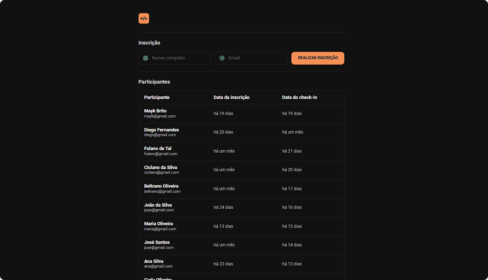

<h1 align="left"> Pass In Web </h1>

Pass in Web que fiz do zero conforme a aula do NLW da Rocketseat Trilha: Full Stacks que engloba HTML, CSS e JavaScript.

---

## 🚀 Tecnologias Usadas

- HTML 
- CSS
- JavaScript
- Git e Github

O projeto foi feito no Visual Studio Code.
